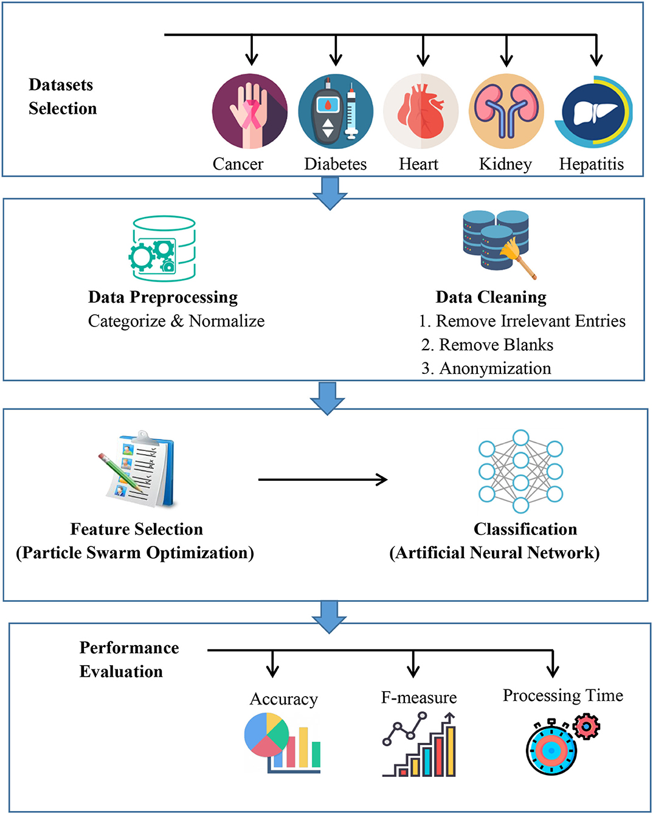

# Multiple Disease Prediction App
A web application that predicts various diseases based on symptoms and lab tests using machine learning models. The app is built using the Streamlit framework in Python and has a user-friendly interface that allows users to enter their symptoms and get predictions in real-time.

## Table of Contents
1. Features
2. Installation
3. Usage
4. Working of web app
5. Models
6. Datasets
7. Deployment
8. Requirements
9. Contributing
10. License

## Features
- A web app developed using the streamlit framework in Python. 
- The app predicts various diseases based on symptoms and lab tests. (currently, the app can predict stroke and diabetes)
- Trained on Kaggle datasets, the ML models have a high level of accuracy. 
- User-friendly interface that requires users to only enter their symptoms to check which disease they may be suffering from. 
- Currently, the app can predict stroke and diabetes with a recall of 100% for stroke prediction.
- Deployed and in working status on Render.

## Installation
To run the project locally, follow these steps:
1. Clone the repository to your local machine: 
   git clone https://github.com/1Abneesh/Multiple_Disease_prediction_app.git
2. Navigate to the project directory: 
  cd Multiple_Disease_prediction_app
3. Create a virtual environment and activate it: 
  python3 -m venv venv 
  source venv/bin/activate
4. Install the required packages: 
  pip install -r requirements.txt
7. Run the app using the following command:  
  streamlit run app.py
  

## Usage
1. Enter the symptoms of the patient.
2. The app will predict which disease the patient may be suffering from.

## Working

  

## Models
The diabetes prediction is done using a Support Vector Classifier (SVC) with an accuracy of 76%. The stroke prediction is done using an Artificial Neural Network (ANN) with an accuracy of 96%. The machine learning models used in the Multiple Disease Prediction App are present in the ML models notebook folder.

## Datasets
The datasets used to train the models are available in the `Datasets` folder.

## Deployment
The Multiple Disease Prediction App is currently deployed on Render and is accessible at https://multiple-disease-prediction-app.onrender.com/.

## Requirements
The required packages are listed in the `requirements.txt` file.

## Contributing
If you'd like to contribute to the Multiple Disease Prediction App, please follow the contributing guidelines in the repository.

## License
The Multiple Disease Prediction App is licensed under the terms of the MIT License.

